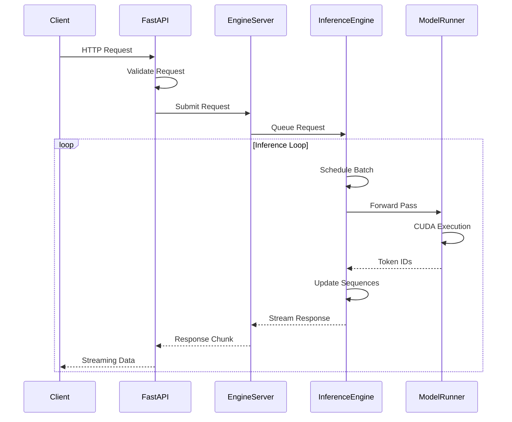

# Architecture Overview

SFLLM is designed as a high-performance, scalable serving framework with a multi-process architecture that separates concerns for optimal performance and reliability.

## System Architecture

```
┌─────────────────────────────────────────────────────────────────────────┐
│                             Client Layer                                │
├─────────────────────────────────────────────────────────────────────────┤
│  HTTP Clients  │  SDKs (OpenAI)  │  Web Applications  │  CLI Tools      │
└─────────────────┬───────────────────────────────────────────────────────┘
                  │ HTTP/REST API (OpenAI Compatible)
┌─────────────────┴───────────────────────────────────────────────────────┐
│                          FastAPI Server                                 │
│  ┌─────────────────┐  ┌─────────────────┐  ┌─────────────────────────┐ │
│  │   Request       │  │   Response      │  │     Health & Metrics    │ │
│  │   Validation    │  │   Formatting    │  │     Monitoring          │ │
│  └─────────────────┘  └─────────────────┘  └─────────────────────────┘ │
└─────────────────┬───────────────────────────────────────────────────────┘
                  │ Async Queue Communication
┌─────────────────┴───────────────────────────────────────────────────────┐
│                        EngineServer                                     │
│  ┌─────────────────┐  ┌─────────────────┐  ┌─────────────────────────┐ │
│  │   Request       │  │   Response      │  │     Multiprocess        │ │
│  │   Queue         │  │   Streaming     │  │     Management          │ │
│  └─────────────────┘  └─────────────────┘  └─────────────────────────┘ │
└─────────────────┬───────────────────────────────────────────────────────┘
                  │ Multiprocessing Queue
┌─────────────────┴───────────────────────────────────────────────────────┐
│                      InferenceEngine                                    │
│  ┌─────────────────┐  ┌─────────────────┐  ┌─────────────────────────┐ │
│  │   Scheduler     │  │   Batch         │  │     RequestSequence            │ │
│  │   & Queue       │  │   Formation     │  │     Management          │ │
│  └─────────────────┘  └─────────────────┘  └─────────────────────────┘ │
└─────────────────┬───────────────────────────────────────────────────────┘
                  │ GPU Compute
┌─────────────────┴───────────────────────────────────────────────────────┐
│                       ModelRunner                                       │
│  ┌─────────────────┐  ┌─────────────────┐  ┌─────────────────────────┐ │
│  │   Model         │  │   CUDA Graph    │  │     KV Cache            │ │
│  │   Execution     │  │   Optimization  │  │     Management          │ │
│  └─────────────────┘  └─────────────────┘  └─────────────────────────┘ │
└─────────────────────────────────────────────────────────────────────────┘
```

## Core Components

### 1. FastAPI Server (`serving/app.py`)

**Responsibilities:**
- Handle HTTP requests and responses
- Request validation and parsing
- Response formatting and streaming
- CORS and middleware management
- Health check endpoints

**Key Features:**
- Asynchronous request handling
- OpenAI-compatible API endpoints
- Real-time streaming with Server-Sent Events
- Automatic request/response validation

```python
# Key interfaces
@app.post("/v1/chat/completions")
async def chat_completions(request: ChatRequest)

@app.post("/v1/completions") 
async def completions(request: CompletionRequest)
```

### 2. EngineServer (`serving/engine_server.py`)

**Responsibilities:**
- Process isolation and management
- Inter-process communication
- Request queue management
- Response aggregation and streaming

**Key Features:**
- Multiprocessing with spawn method (CUDA compatibility)
- Async response handling
- Request lifecycle management
- Process health monitoring

```python
class EngineServer:
    async def submit_request(self, request_data) -> str
    async def get_response(self, sequence_id) -> AsyncGenerator
    def start(self) -> None
    async def stop(self) -> None
```

### 3. InferenceEngine (`engine/inference_engine.py`)

**Responsibilities:**
- Request scheduling and batching
- RequestSequence lifecycle management
- Model inference coordination
- Resource optimization

**Key Features:**
- Intelligent request batching by sequence length
- Priority-based scheduling
- Memory-efficient sequence management
- Performance metrics collection

```python
class InferenceEngine:
    def add_request(self, sequence: RequestSequence) -> int
    def step(self) -> Tuple[SequenceGroup, List[RequestSequence]]
    def generate(self, prompts: List[str]) -> Generator
```

### 4. ModelRunner (`engine/model_runner.py`)

**Responsibilities:**
- Direct model execution
- CUDA graph optimization
- Memory management
- Kernel optimization

**Key Features:**
- Automatic CUDA graph capture
- Dynamic batch size optimization
- KV-cache management
- Custom attention kernels

```python
class ModelRunner:
    def forward(self, sequence_group: SequenceGroup) -> List[int]
    def capture_graph(self) -> None
    def prepare_inputs(self, sequences) -> Dict[str, Any]
```

## Data Flow

### 1. Request Processing Flow



### 2. Batching Strategy

SFLLM uses intelligent batching based on sequence similarity:

```python
# Pseudo-code for batching logic
def schedule_batch(pending_requests):
    # Group by similar sequence lengths
    length_groups = group_by_length(pending_requests)
    
    # Prioritize largest compatible batch
    for group in sorted(length_groups, key=len, reverse=True):
        if can_fit_in_memory(group):
            return create_batch(group)
    
    # Fallback to single request
    return create_batch([pending_requests[0]])
```

### 3. Memory Management

```
┌─────────────────────────────────────────────────────────────────┐
│                       GPU Memory Layout                         │
├─────────────────────────────────────────────────────────────────┤
│  Model Weights (Static)                                         │
│  ├─── Embedding Layer                                           │
│  ├─── Transformer Blocks                                        │
│  └─── Output Layer                                              │
├─────────────────────────────────────────────────────────────────┤
│  KV Cache Pool (Dynamic)                                        │
│  ├─── Active Sequences                                          │
│  ├─── Cached Sequences                                          │
│  └─── Free Blocks                                               │
├─────────────────────────────────────────────────────────────────┤
│  Computation Buffers                                            │
│  ├─── Input Tensors                                             │
│  ├─── Attention Outputs                                         │
│  └─── Temporary Buffers                                         │
├─────────────────────────────────────────────────────────────────┤
│  CUDA Graphs (Pre-allocated)                                    │
│  └─── Batch Size Variants [1, 2, 4, 8, ...]                   │
└─────────────────────────────────────────────────────────────────┘
```

## Performance Optimizations

### 1. CUDA Graph Optimization

CUDA graphs eliminate kernel launch overhead by pre-recording computation graphs:

```python
# Graph capture process
for batch_size in [1, 2, 4, 8, 16, 32]:
    with torch.cuda.graph(cuda_graph):
        output = model(input_batch[batch_size])
    
    # Store for later replay
    cuda_graphs[batch_size] = cuda_graph
    output_buffers[batch_size] = output
```

**Benefits:**
- 20-40% performance improvement for small batches
- Reduced CPU-GPU synchronization
- Consistent latency for decode operations

### 2. Attention Kernel Optimization

Custom Triton kernels for attention computation:

```python
# Optimized attention variants
- Flash Attention for prefill phase
- Paged Attention for decode phase  
- Ragged Attention for variable lengths
```

### 3. Request Scheduling

Smart scheduling algorithm optimizes for throughput:

```python
class Scheduler:
    def schedule(self) -> SequenceGroup:
        # Priority: sequence length similarity
        groups = self.group_by_length_similarity()
        
        # Select optimal batch size
        for group in groups:
            if self.fits_memory_budget(group):
                return self.create_sequence_group(group)
```

## Scalability Features

### 1. Horizontal Scaling

Multiple server instances can be deployed behind a load balancer:

```yaml
# Example Kubernetes deployment
apiVersion: apps/v1
kind: Deployment
metadata:
  name: sfllm-deployment
spec:
  replicas: 3
  template:
    spec:
      containers:
      - name: sfllm
        image: sfllm:latest
        resources:
          limits:
            nvidia.com/gpu: 1
```

### 2. Vertical Scaling

Single instance can utilize multiple GPUs:

```python
# Multi-GPU configuration (planned feature)
model_parallel_size = 2
pipeline_parallel_size = 2
```

## Monitoring and Observability

### 1. Metrics Collection

Key performance indicators tracked:

- **Throughput**: Requests per second
- **Latency**: Time to first token (TTFT) and inter-token latency
- **GPU Utilization**: Memory and compute usage
- **Queue Depth**: Pending request count
- **Error Rates**: Failed requests by type

### 2. Health Checks

Multiple health check levels:

```python
# Application health
GET /health
{
  "status": "healthy",
  "timestamp": 1698765432,
  "gpu_memory": "8.5GB / 24GB",
  "queue_size": 5
}

# Deep health check
GET /health/deep
{
  "model_loaded": true,
  "cuda_available": true,
  "inference_engine": "ready",
  "last_inference": "2023-10-31T10:30:45Z"
}
```

## Configuration Management

### 1. Server Arguments

Centralized configuration via `ServerArgs`:

```python
@dataclass
class ServerArgs:
    model_path: str
    dtype: str = "auto"
    port: int = 8081
    cuda_graph_max_bs: int = 32
    max_context_length: int = 4096
    disable_cuda_graph: bool = False
```

### 2. Environment Variables

Runtime configuration via environment:

```bash
export SFLLM_MODEL_PATH=/models/qwen3
export SFLLM_CUDA_VISIBLE_DEVICES=0,1
export SFLLM_LOG_LEVEL=INFO
```

## Security Considerations

### 1. Input Validation

- Request size limits
- Parameter validation
- Content filtering hooks

### 2. Resource Protection

- Memory usage limits
- Request timeout handling
- Rate limiting (via proxy)

### 3. Process Isolation

- Separate inference processes
- Crash recovery mechanisms
- Resource cleanup on shutdown

## Future Architecture Enhancements

### 1. Planned Features

- **Multi-GPU Support**: Model and pipeline parallelism
- **Paged KV-Cache**: More efficient memory management
- **Dynamic Batching**: Real-time batch size adjustment
- **Model Quantization**: INT8/INT4 support
- **Speculative Decoding**: Draft model acceleration

### 2. Extensibility Points

- **Custom Samplers**: Pluggable sampling strategies  
- **Attention Backends**: Multiple attention implementations
- **Model Loaders**: Support for different model formats
- **Scheduling Policies**: Alternative batching strategies

This architecture provides a solid foundation for high-performance LLM serving while maintaining flexibility for future enhancements and optimizations.